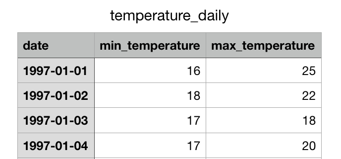
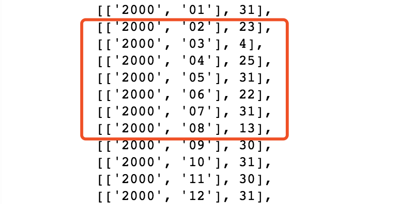
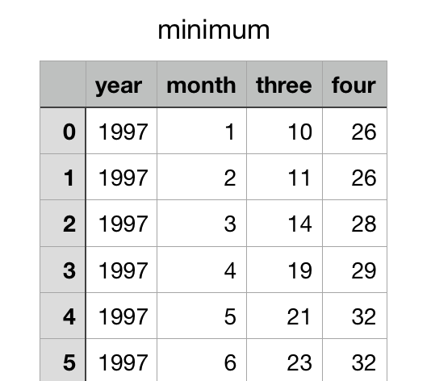
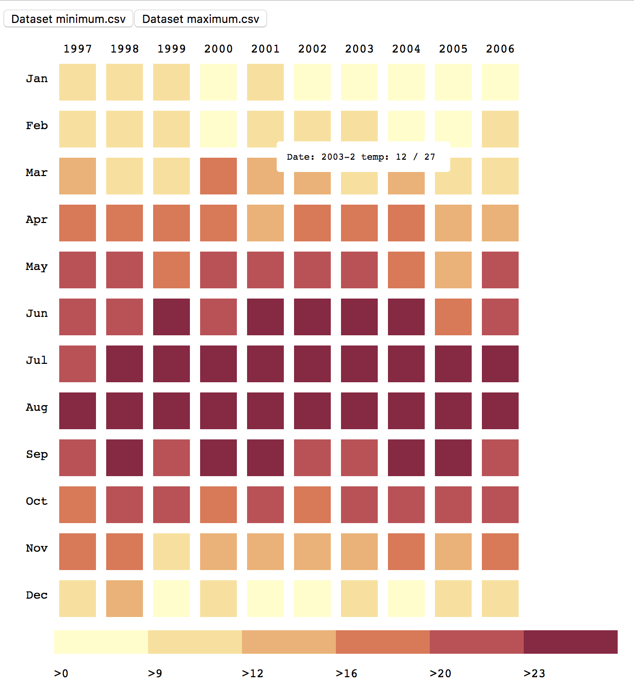
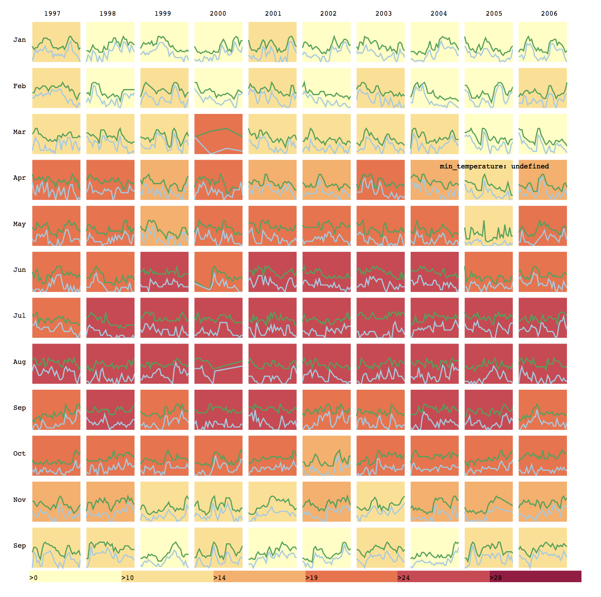

# README

## About Code

### Level 1

- `Level 1 Final.html` : The D3.js code of Level 1. The D3.js version is V3. 
  - Work Time: 07.27 - 07.29
- `preprocess.py` : The python code of Level 1 to preprocess the dataset `temperature_daily.csv` and output the preprocessed dataset `minimum.csv` and `maximum.csv`.
- `minimum.csv` : The first and second column records the year and the month separately. The third and forth column records the minimum temperature and maximum temperature separately.
- `maximum.csv` : The first and second column records the year and the month separately. The third and forth column records the maximum temperature and minimum temperature separately. 

### Level 2

- `Level 2 Attempt.html` : The D3.js code of Level 2. The D3.js version is V3. Didn't realize all the requests of Level 2.
  - Work Time: 08.03 - 08.04
- `temperature_daily.csv` : The original dataset.

## About Dataset

The dataset `temperature_daily.csv` records the minimum temperature and maximum temperature of each day in ten years (from 1997 to 2006).

### Missing Data

Before I did data visualization by Javascript with D3 in Level 1, I had preprocessed the data `temperature_daily.csv` by Python and found that some parts of data in 2000 were missing.  There were 3,580 records in the dataset and I counted the number of the records per month. From the picture below, it is obvious that there are about sixty records missing from February to August, in 2000.

       

### Preprocessed Dataset Used in Level 1

Besides counting the records of each months, I used Python to find out the minimum temperature and maximum temperature of each month and then output them into `minimum.csv` and `maximum.csv` separately. The format of these csv is the same as the below picture.

## Result

### Level 1

### Level 2

There are some functions that didn't realise:

- A tip to show the date and the temperature value.
- Visualize the daily changes of the maximum and minimum temperature in each cell.

## Conclusion

This is the first time that I learn and use D3.js and I think the syntactic form of D3.js is similar to the syntactic form of Spark, which I have learnt in the Big Data Computing class. Because of this, I can understood basic example code from Internet course. However, I still had troubles in processing data by D3.js and  bounding data with variable at beginning, so I used Python to find out the minimum temperature and maximum temperature in each month and solved the level 1.

Using Python to processing data is not suitable for level 2 because the data visualization in level 2 needs all data to draw the linear chart and it seems that using D3.js is much better. What's more, the problem in level 2 requests to combine the heatmap chart with linear chart and makes it more difficult. As a result, I didn't complete all the request of Level 2.

### Difficulty through Test

- Green hands to D3.js.
  - Solve: Find simple examples with explanations to practice.[OUR D3.JS](http://www.ourd3js.com/wordpress/)

- Some useful examples on Internet are written by d3.v4.min.js or d3.v5.min.js, which has many differents from d3.v3.min.js.
  - Solve: Find a good webpage to know the change. [d3/CHANGES](https://github.com/d3/d3/blob/master/CHANGES.md#scales-d3-scale) 
- Failed to load local file to Chrome browser, because cross origin requests are only supported for protocol schemes: http, data, chrome, chrome-extension, https.
  - Solve: Use command `open -n /Applications/Google\ Chrome.app/ --args --disable-web-security  --user-data-dir=/Users/xumin/MyChromeDevUserData/ ` to open the Chrome browser. 
  - Tips: The command will be invalid when using d3.v5.min.js in Chrome browser. Use Firefox browser can avoid the problem.
- Don't know how to process data in Level 1 at beginning.
  - Solve: Use python to process and output the data needed in the Level 1 and let the data format adjust to the heatmap example given by the D3.js official website.
- Spend some time to find how to add tooltip in Level 1.
  - Solve: Use different examples to try and with the help of [Tool Tip](https://blog.csdn.net/ImagineCode/article/details/79485408) .
- Don't know how to process data in Level 2.
  - Solve: The `nest` function and `forEach` function are reminded by friend and then learn from Internet.
- Failed to add tooltip in Level 2.
  - Unsolved
- Some lines are out of its heatmap cell.
  - Unsolved
- Visualize the daily changes of the maximum and minimum temperature in each cell in Level 2.
  - Unsolved

## Reference

D3.js Official Website: https://d3js.org/

OUR D3.JS: http://www.ourd3js.com/wordpress/

Version Changes: https://github.com/d3/d3/blob/master/CHANGES.md#scales-d3-scale

Level 1: http://bl.ocks.org/tjdecke/5558084

Line Chart: https://bl.ocks.org/mbostock/3883245

Tool Tip: https://blog.csdn.net/ImagineCode/article/details/79485408

